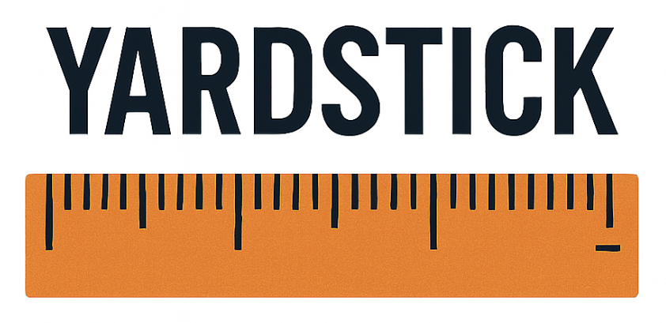

[![GitHub Release][release-img]][release]
[![Test][test-img]][test]
[![Go Report Card][go-report-img]][go-report]
[![License: Apache-2.0][license-img]][license]

An MCP Server and Client that provides a yardstick implementation and reference for testing. 

## Features
- [Server](./cmd/yardstick-server/README.md)
  - **Full Transport Coverage**: Supports running in all three transport types (`stdio`,`sse` and `streamable-http`)
  - **Deterministic response**: Provides the ability for deterministic testing, ensuring each response is tied to its specific request
  - **Securely built**: Secure and minimal OCI Image that does not require elevated privileges to run
- [Client](./cmd/client/README.md)
  - **Full Transport Coverage**: Supports running against all types of MCP Servers (`stdio`,`sse` and `streamable-http`)
  - **Support for Containers**: Containerised MCP Servers are supported (and preferred)

Currently there are many Clients and MCP Servers that do many things, however there weren't any that satisfied our need for testing. We required a deterministic MCP server that had first class container support and was securely built. We also required Clients that can be used against all three transport types that can be used in a testing process.

## Contributing

We welcome contributions to this MCP server! If you'd like to contribute, please
review the [CONTRIBUTING guide](./CONTRIBUTING.md) for details on how to get
started.

If you run into a bug or have a feature request, please
[open an issue](https://github.com/StacklokLabs/yardstick/issues) in the repository
or join us in the `#mcp-servers` channel on our
[community Discord server](https://discord.gg/stacklok).

## License

This project is licensed under the Apache v2 License - see the LICENSE file for
details.

<!-- Badge Links -->
[release-img]: https://img.shields.io/github/release/StacklokLabs/yardstick.svg
[release]: https://github.com/StacklokLabs/yardstick/releases
[test-img]: https://github.com/StacklokLabs/yardstick/workflows/Main%20build/badge.svg
[test]: https://github.com/StacklokLabs/yardstick/actions?query=workflow%3ATest
[go-report-img]: https://goreportcard.com/badge/github.com/StacklokLabs/yardstick
[go-report]: https://goreportcard.com/report/github.com/StacklokLabs/yardstick
[license-img]: https://img.shields.io/badge/License-Apache%202.0-blue.svg
[license]: https://opensource.org/licenses/Apache-2.0
